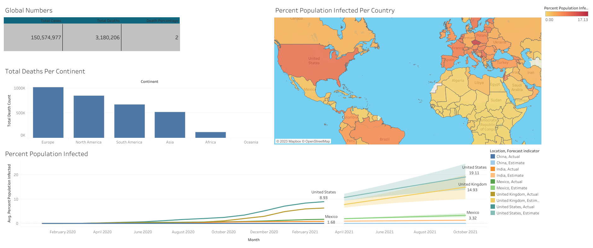

# PortfolioProject-About-COVID-In-The-World

In this project, I used SQL to do some Data Exploration from the two Excel files(CovidDeaths & CovidVaccinations). 

Then I took some of the SQL queries worked above and created visualizations in Tableau.

You can find the work done in the following website (Tableau Public)
https://public.tableau.com/app/profile/krystenliu/viz/COVIDDashboardProject2/Dashboard1

